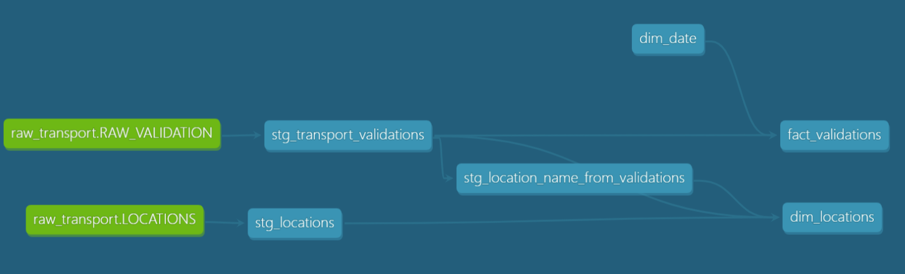

# Île-de-France Ridership Analytics

End-to-end analytics engineering project analyzing public transport ridership evolution across the Île-de-France network using Snowflake, dbt, and Metabase.

The project combines data engineering and analytics to transform raw transportation datasets into a structured analytical platform delivering insights on ridership trends, station usage, and traffic evolution.

---

# Project Overview

This project was designed to analyze ridership evolution in Île-de-France public transportation and support data-driven transport planning decisions.

The platform enables analysis of:
- ridership evolution over time
- busiest stations across the network
- station-level growth and decline
- weekday vs weekend usage patterns
- seasonal ridership behavior

The project demonstrates:
- cloud data warehousing
- ELT pipeline development
- dimensional modeling
- dbt transformation workflows
- data quality testing
- analytics engineering best practices
- BI dashboard development

---

# Business Questions

The project aims to answer the following business questions:

- How does ridership evolve year-over-year at station level?
- Which stations concentrate the highest traffic?
- Which stations show abnormal growth or decline?
- How do weekday and weekend ridership patterns differ?
- Which stations exhibit structural changes in usage over time?

---

# Data Sources

The project uses datasets from the RATP / Île-de-France Mobilités open data platform.

Main datasets:
- Quarterly ridership files containing daily validation counts per station
- Station reference database containing station metadata

## Main Data Challenges

### Historical Station References

The station reference dataset only reflects the latest station information and does not maintain historical station versions or renamed stations.

This creates referential integrity issues when analyzing historical ridership data.

### Quarterly File Variability

Quarterly ridership files exhibit structural variations between periods, requiring:
- cleaning
- standardization
- schema harmonization

before analytical processing.

---

# Tech Stack

| Layer | Tools |
|---|---|
| Data Warehouse | Snowflake |
| Data Transformation | dbt |
| Data Visualization | Metabase |
| Version Control | Git & GitHub |
| Query Language | SQL |

---

# Architecture

The project follows a modern ELT architecture:

```text
Raw CSV Files
        ↓
Snowflake Raw Layer
        ↓
dbt Staging Models
        ↓
dbt Mart Models
        ↓
Metabase Dashboards

#Metabase dashboard
```

## dbt model preview



## Data warehouse preview


## Dashboard Preview


